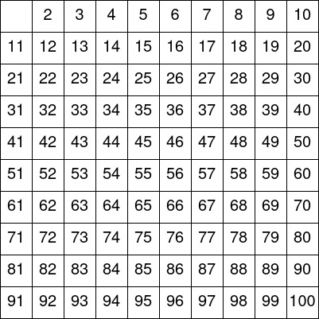
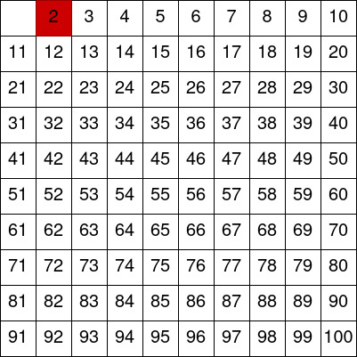
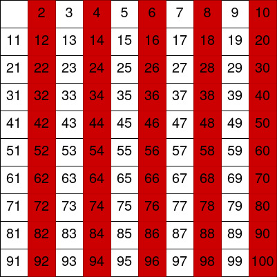
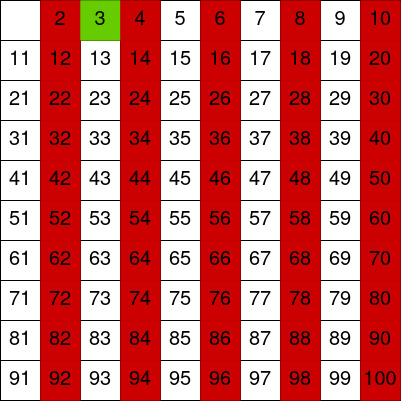
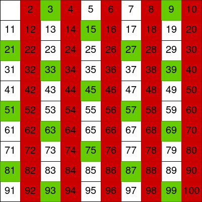
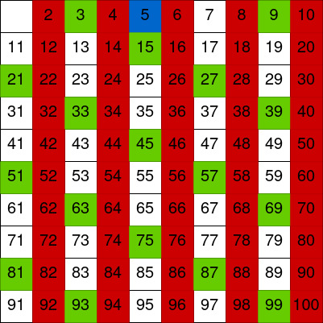
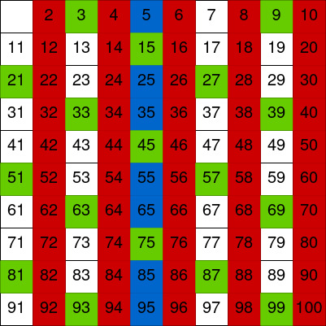
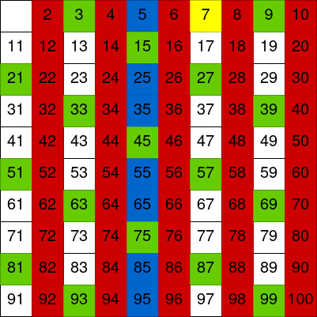
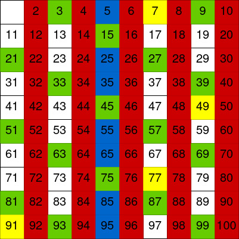
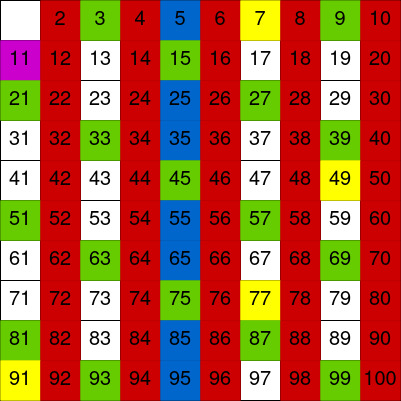

## Concurrent programming in Rust and Go

---
## Sieve of Eratosthenes

+++
## Sieve of Eratosthenes

+++
## Sieve of Eratosthenes

+++
## Sieve of Eratosthenes

+++
## Sieve of Eratosthenes

+++
## Sieve of Eratosthenes

+++
## Sieve of Eratosthenes

+++
## Sieve of Eratosthenes

+++
## Sieve of Eratosthenes

+++
## Sieve of Eratosthenes

---
@snap[span-100]
## Concurrent Sieve of Eratosthenes
@snapend

@snap[south-west]

@snap[fragment]

@snapend

@snap[fragment]

@snapend

@snapend

---
@snap[north-west]
## Concurrent Sieve
@snapend

@snap[west]

@img[fragment position=left](assets/img/ConcurrentSieve_2-3.jpg)
@img[fragment](assets/img/ConcurrentSieve_2-3-5.jpg)

@snapend

---
@snap[span-100]
## Concurrent Sieve of Eratosthenes
@snapend

@img[fragment position=left](assets/img/ConcurrentSieve_2-3.jpg)
@img[fragment](assets/img/ConcurrentSieve_2-3-5.jpg)

---
@snap[north span-100]
## Classic vs Concurrent
@snapend

@snap[west span-40 text-center]
### Classic

@ul[text-center]
- find all primes between 2 and x
- offline
@ulend
@snapend

@snap[east span-40]
concurrent sieve

find the first n primes
@snapend
---

Let's turn this into an online algorithm
ceheck primality on the fly

---?code=go-sieve.go&lang=go
@snap[north-east]
## GO
@snapend

@[3]
@[20-32]
@[5-9]
@[11-18]

---?code=rust-sieve-thread.rs&lang=rust
@snap[north-east]
## Rust
@snapend
@[1-4]
@[28-45]
@[6-12]
@[14-26]

---
## Results

| 	|GO 	|Rust 	|
|-------|-------|-------|
|100 	|2.5 ms	|35 ms 	|
|1000 	|180 ms	|2.25 s	|

@snap[fragment]
 
Rust is about one magnitude **slower** than GO
@snapend
---
# Concurrency is not Parallelism
---
## Concurrency

@ul[list-spaced-bullets]
- time-sharing
- multitasking
- task switching
@ulend
---
@snap[north]
## Multitasking
Bake a cake and clean your room!
@snapend

@snap[south span-50 text-center]
@css[fragment](bake the cake first)
@css[fragment](clean your room afterwards)
@snapend

@snap[south-east span-50 text-center]
@css[fragment](prepare the ingredients and put the cake in the oven)
@css[fragment](clean your room in the meantime)
@css[fragment](finish the cake)
@snapend

---
@snap[north-west font-raleway-heavy text-blue text-22]
Multitasking
@snapend

@snap[west span-50 text-center]
bake the cake first
clean your room afterwards
@snapend

@snap[east span-50 text-center]
prepare the ingredients and put the cake in the oven
clean your room in the meantime
finish the cake
@snapend
---
@snap[north font-raleway-heavy text-blue text-22]
Multitasking
Problem: You need to bake a cake and clean your room!
@snapend

@ul[south-west span-50 text-center list-no-bullets]
- bake the cake first
- clean your room afterwards
@ulend

@ul[south-east span-50 text-center list-no-bullets]
- prepare the ingredients and put the cake in the oven
- clean your room in the meantime
- finish the cake
@ulend
---
@snap[north]
## Multitasking
Problem: You need to bake a cake and clean your room!
@snapend

@snap[south-west list-spaced-bullets]
@ul[text-08]
- bake the cake first
- clean your room afterwards
@ulend
@snapend

@snap[south-east list-spaced-bullets]
@ul[text-08]
- prepare the ingredients and put the cake in the oven
- clean your room in the meantime
- finish the cake
@ulend
@snapend
---
## Parallelism

@ul[list-spaced-bullets]
- only possible with hardware support (multiple cores, processors)
- increase throughput
@ulend

---
## Concurrency and Parallelism

---
## Concurrency vs Parallelism

@ul[list-spaced-bullets text-08]
- **Concurrency** is the composition of independently executing processes
- **Parallelism** is the simultaneous execution of (possibly related) computations
@ulend

@ul[list-spaced-bullets text-08]
- **Concurrency** is about *dealing* with lots of things at once.
- **Parallelism** is about *doing* lots of things at once.
@ulend

---
## problem

---
## fine-grained concurrency

---
## more parallelization

---
## intermaediate summary

@ul[list-spaced-bullets]
- *real parallelism* is only possible with hardware support (with multiple cores)
- the main benefit from *real parallelism* is increased throughput
- with *concurrencly* parallelism can be simulated
- 
@ulend

