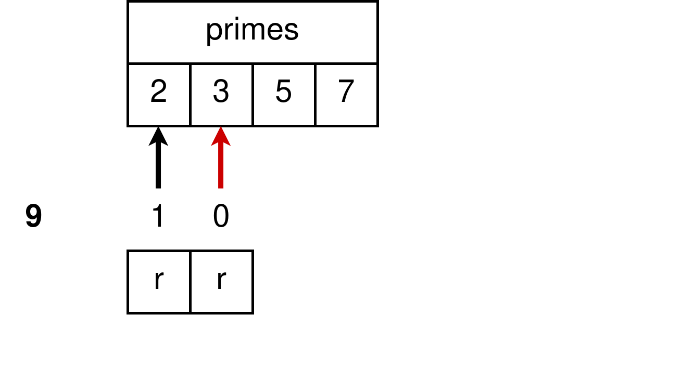

## Concurrent programming in Rust and Go

---
## Sieve of Eratosthenes

---
@snap[north span-100]
## Sieve of Eratosthenes
@snapend
The classic version
 
@ul[list-no-bullets text-08]
- Goal: Find all the prime numbers between 2 and *x*
-  
- Algorithm:
- Create an array containing all positive integers between 2 and *x*.
- Consider each number in the array from smallest to largest.
- **If the next number *num* is unmarked, then *num* is a prime**! Mark all the multiples of *num* in the array!
- Repeat until all elements of the array have been considered.

@ulend

---
@snap[north span-100]
## Sieve of Eratosthenes
@snapend
 
 

---
@snap[north span-100]
## Sieve of Eratosthenes
@snapend
 
@ul[list-no-bullets text-08]
- Goal: @css[fragment](Find the first *n* prime numbers)
-  
- Algorithm:
- Keep the primes found so far in an array *primes*.
- Consider all positive integers one by one starting from 2.
- **If a number *num* is not divisible by any of the primes found so far, then *num* is a prime**!
- Add *num* to *primes* and continue until *n* primes have been found.
@ulend

---
## Sieve of Eratosthenes

+++
## Sieve of Eratosthenes

+++
## Sieve of Eratosthenes

+++
## Sieve of Eratosthenes

+++
## Sieve of Eratosthenes

+++
## Sieve of Eratosthenes

+++
## Sieve of Eratosthenes

+++
## Sieve of Eratosthenes

+++
## Sieve of Eratosthenes

+++
## Sieve of Eratosthenes

+++
## Sieve of Eratosthenes

---?code=rust/sequential/src/lib.rs&lang=rust
@snap[north-east]
## Rust
@snapend

@[1]
@[2,4,7]
@[2]
@[4-5]
@[23-24]
@[7-8,10,13-16,19-21]
@[25]

---
## Concurrent Sieve

@img[fragment](assets/img/concurrent/concurrent_2-3.png)
@img[fragment](assets/img/concurrent/concurrent_2-3-5.png)
@img[fragment](assets/img/concurrent/concurrent_2-3-5-7.png)

---
## Concurrent Sieve

@img[fragment](assets/img/concurrent/concurrent_2-3-5-7-before.png)
@img[fragment](assets/img/concurrent/concurrent_2-3-5-7-after.png)

---?code=go-sieve.go&lang=go
@snap[north-east]
## GO
@snapend

@[3]
@[5-9]
@[11-18]
@[20-32]

---?code=rust/thread-sieve/src/lib.rs&lang=rust
@snap[north-east]
## Rust
@snapend
@[1-4]
@[6-12]
@[14-26]
@[28-45]

---
## Results

| 	|GO 	|Rust 	|
|-------|-------|-------|
|100 	|2.5 ms	|35 ms 	|
|1000 	|180 ms	|2.25 s	|

@snap[fragment]
 
Rust is about one magnitude **slower** than GO
@snapend

---
# Concurrency is not Parallelism

---
## Concurrency is about structure
## Parallelism is about execution

---

burn the books

---

a friend drops by

---

load the cart
carry the cart
load the incinerator

---

load the cart
carry the loaded cart
return the empty cart
load the incinerator

---
The more people are around, the faster the process goes.

Single core performance has reached its limits.
But the number of cores in a single processor has been increasing rapidly.

Good (concurrent) design allows you to:
Sit back, buy new hardware and watch your program run faster!
(like in the Good Ol' Days)

---

---

---

---

---

---
Let's get realistic

So far we were concerned with having too many workers but too few tasks to keep all of them busy. Therefore we needed to split up complex tasks into smaller (partially) independent pieces.

But for many years, computer scientists have had the problem of having too few workers and a lot of tasks to run. Actually even nowadays, the best affordable chips still do not have more than a few dozens of cores.

---
Ideally, the concurrent sieve algorithm implemented with threads will get blazingly fast in the future because there will be enough hardware parallelism available to assign each task to a dedicated computational unit. 

But for the time being, we would still like to be able to write a relatively efficient version of the concurrent sieve algorithm. Looking at GO's performance, it is obvious that there must be a way to improve Rust's performance!

---
Concurrency revisited

We said concurrency is about structure and that a well designed concurrent system can make heavy use of available hardware parallelism in order to improve performance dramatically.

But, concurrent structure can also be extremely beneficiary on single core CPU's.

How is that?

---
Concurrency revisited

Write an essay, clean your place and bake a cake.

Possible structures:
1)
Task 1: write an essay
Task 2: clean your place
Task 3: bake a cake

2)
Task 1.1: brainstorm
Task 1.2: write the introduction
Task 1.3: write the main part
Task 1.4: write the conclusion
Task 2.1: clean downstairs
Task 2.2: clean upstairs
Task 2.3: clean the basement
Task 2.3: clean the attic
Task 3.3: buy the ingredients
Task 3.2: prepare the cake
Task 3.3: put the cake in the oven and wait till it's done
Task 3.4: finish the cake

The main benefit of this structure is

---?code=rust/async-await-channel/src/lib.rs&lang=rust
@snap[north-east]
## Rust
@snapend

@[1-2]
@[4-18]
@[5-8,12-17]
@[9-11]
@[6]
@[7]
@[13]
@[10]
@[13]
@[15](Hello)
@[16]
@[10]
@[16](World)

---?code=rust/async-await-sieve/src/lib.rs&lang=rust
@snap[north-east]
## Rust
@snapend

@[1-4]
@[6-10]
@[12-24]
@[26-41]

---
## async/await

@css[fragment](Rust's **async/await** syntax allows us to express **concurrent design** easily.)

@css[fragment](Note that we did not say anything about how much **parallelism** we want!)

@css[fragment](This code can be run on a **single CPU** but can also make use of **multiple cores** if available.)

---
## Results

| 	|GO 	|Rust (thread) 	|Rust (task) 	| 	
|-------|-------|---------------|---------------|
|100 	|2.5 ms	|35 ms 		|    4.5 ms 	|
|1000 	|180 ms	|2.25 s		|    240 ms 	|

---
---
................................................................................

---

Clean your place, bake a cake and write a book.

In the computer science world concurrent also means "seemingly parallel" 

This is achieved by extremely rapid task switching.

Concurrent processes can be executed on one core by interleaving the execution steps of each process

---
## Multitasking

Multitasking is the concurrent execution of multiple tasks (Wiki)

A concurrent system is one where a computation can advance without waiting for all other computations to complete.

Concurrent processes can be executed on one core by interleaving the execution steps of each process

Concurrency in the sense of "seemingly parallel" achieved by extremely rapid task switching.

---

Why concurrency?

- throughput
concurrent design makes parallelization easy

- responsiveness

- convenience

---
responsiveness

Often, processes 

---
---
## Parallelism

@ul[list-spaced-bullets]
- only possible with hardware support (multiple cores, processors)
- increase throughput
@ulend

---
## Concurrency

similar 
@ul[]
- time-sharing
- multitasking
- task switching
@ulend
---
@snap[north]
## Multitasking
Bake a cake and clean your room!
@snapend

@snap[south-west span-50 text-center]
@css[fragment](bake the cake first)
@css[fragment](clean your room afterwards)
@snapend

@snap[south-east span-50 text-center]
@css[fragment](prepare the ingredients and put the cake in the oven)
@css[fragment](clean your room in the meantime)
@css[fragment](finish the cake)
@snapend

---
@snap[north-west font-raleway-heavy text-blue text-22]
Multitasking
@snapend

@snap[west span-50 text-center]
bake the cake first
clean your room afterwards
@snapend

@snap[east span-50 text-center]
prepare the ingredients and put the cake in the oven
clean your room in the meantime
finish the cake
@snapend
---
@snap[north font-raleway-heavy text-blue text-22]
Multitasking
Problem: You need to bake a cake and clean your room!
@snapend

@ul[south-west span-50 text-center list-no-bullets]
- bake the cake first
- clean your room afterwards
@ulend

@ul[south-east span-50 text-center list-no-bullets]
- prepare the ingredients and put the cake in the oven
- clean your room in the meantime
- finish the cake
@ulend
---
@snap[north]
## Multitasking
Problem: You need to bake a cake and clean your room!
@snapend

@snap[south-west list-spaced-bullets]
@ul[text-08]
- bake the cake first
- clean your room afterwards
@ulend
@snapend

@snap[south-east list-spaced-bullets]
@ul[text-08]
- prepare the ingredients and put the cake in the oven
- clean your room in the meantime
- finish the cake
@ulend
@snapend
---
## Concurrency and Parallelism

---
## Concurrency vs Parallelism

@ul[list-spaced-bullets text-08]
- **Concurrency** is the composition of independently executing processes
- **Parallelism** is the simultaneous execution of (possibly related) computations
@ulend

@ul[list-spaced-bullets text-08]
- **Concurrency** is about *dealing* with lots of things at once.
- **Parallelism** is about *doing* lots of things at once.
@ulend

---
## problem

---
## fine-grained concurrency

---
## more parallelization

---
## intermaediate summary

@ul[list-spaced-bullets]
- *real parallelism* is only possible with hardware support (with multiple cores)
- the main benefit from *real parallelism* is increased throughput
- with *concurrencly* parallelism can be simulated
- 
@ulend

